# 🚀 Telecom OSS Service Provisioning Simulator


A **Full Stack Telecom OSS (Operations Support System)** application that simulates the complete lifecycle of telecom service provisioning.

The application enables telecom operators to create customers, place service orders, execute provisioning workflows, monitor provisioning progress, manage active inventory, generate reports, simulate provisioning failures, visualize network topology, and expose TM Forum TMF641 compliant Service Orders.

---
## Highlights

- Full Stack Telecom OSS/BSS Simulator
- JWT Authentication with RBAC
- TM Forum TMF641 Service Order Generation
- Workflow & Provisioning Engine
- Interactive Dashboard with Analytics
- Failure Simulation & Audit Logging
- React + FastAPI + MongoDB

| Feature | Status |
|---------|--------|
| JWT Authentication | ✅ |
| RBAC | ✅ |
| Customer Management | ✅ |
| Order Management | ✅ |
| Workflow Engine | ✅ |
| Inventory Management | ✅ |
| Dashboard | ✅ |
| Reports | ✅ |
| Failure Simulation | ✅ |
| Audit Logging | ✅ |
| TMF641 Generation | ✅ |
| MongoDB Atlas | ✅ |
| Render Deployment | ✅ |
| Vercel Deployment | ✅ |

# Table of Contents

- Overview
- Features
- Screenshots
- Architecture
- Technology Stack
- Project Structure
- Installation
- Backend Setup
- Frontend Setup
- Environment Variables
- Authentication
- API Modules
- Provisioning Workflow
- Dashboard
- Reports
- TMF641
- Network Topology
- Security
- Deployment
- Future Enhancements
- Learning Outcomes
- Resume Highlights
- Author

---

# Overview

Telecommunication operators provision thousands of customer services every day.

This project simulates a simplified OSS (Operations Support System) used inside telecom companies.

The application allows users to

- Create Customers
- Create Telecom Service Orders
- Execute Provisioning Workflow
- Update Active Inventory
- Track Workflow Stages
- Generate TMF641 Service Orders
- Simulate Provisioning Failures
- Generate Reports
- Export CSV Reports
- View Audit Logs
- Monitor Dashboard Statistics
- Visualize Network Topology

The project follows a modular architecture using FastAPI for backend APIs and React for the frontend dashboard.

---

# Live Demo

- **Frontend:** https://telecom-service-provisioning-simula.vercel.app
- **Backend API:** https://telecom-service-provisioning-simulator.onrender.com
- **Swagger UI:** https://telecom-service-provisioning-simulator.onrender.com/docs

---

# Key Features

## Customer Management

- Create Customers
- Search Customers
- View Customer List
- Company Information
- Contact Information

---

## Service Order Management

- Create Orders
- Search Orders
- Filter Orders by Status
- Execute Provisioning
- Advance Workflow
- View Workflow History
- TMF641 Payload Generation

Supported Services

- VPRN
- EPIPE
- MPLS
- EVPN
- Internet
- VPLS

---

## Workflow Engine

Multi-stage workflow simulation

```
Order Received
      │
      ▼
Validation
      │
      ▼
Resource Check
      │
      ▼
Service Design
      │
      ▼
Provisioning
      │
      ▼
Inventory Update
      │
      ▼
Completed
```

Features

- Workflow Tracking
- Stage History
- Progress Monitoring
- Audit Logging

---

## Provisioning Engine

The Provisioning Engine performs

- Service Validation
- Workflow Execution
- Inventory Creation
- Status Updates
- Audit Logging
- Failure Detection

---

## Inventory Management

Track provisioned services

Features

- Active Services
- Customer Mapping
- Service Status
- Search Inventory

---

## Dashboard

Interactive Dashboard displaying

- Total Customers
- Total Orders
- Active Services
- Completed Orders
- Failed Orders
- Pending Orders
- Success Rate
- Order Status Pie Chart
- Service Distribution Chart
- Priority Distribution Chart

---

## Reports

Generate

- Provisioning Reports
- Failure Reports
- Customer Reports

Export

- Orders CSV
- Customers CSV
- Failures CSV

---

## Failure Simulation

Simulate provisioning failures

Supported

- Resource Unavailable
- Validation Failure
- Provisioning Failure

Includes

- Failure Reason
- Failed Stage
- Suggested Resolution

---

## Audit Logging

Track all important system events

- Login
- Customer Creation
- Order Creation
- Workflow Execution
- Provisioning
- Inventory Updates
- Failures

---

## Telecom APIs

- TMF641 Service Order
- Network Topology API

---

## Authentication

- JWT Authentication
- OAuth2 Password Flow
- Protected APIs
- Role Based Access Control

Supported Roles

- Admin
- Operator
- Viewer

---

# Screenshots

## Frontend

### Login

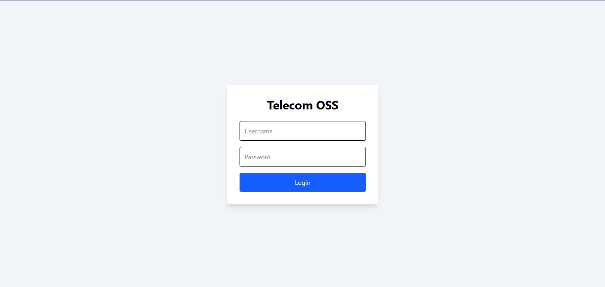

---

### Dashboard

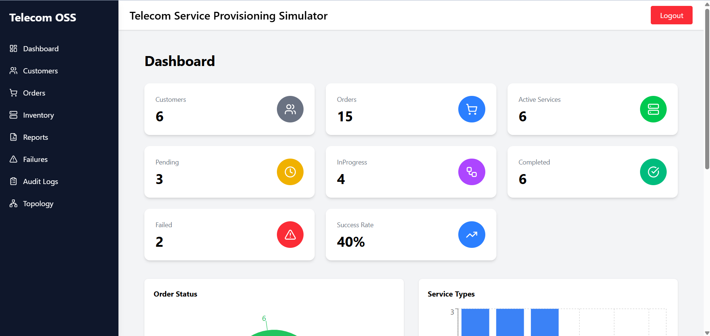

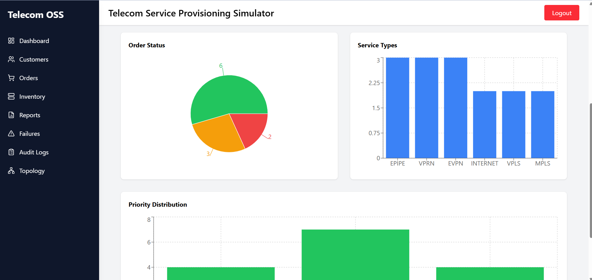

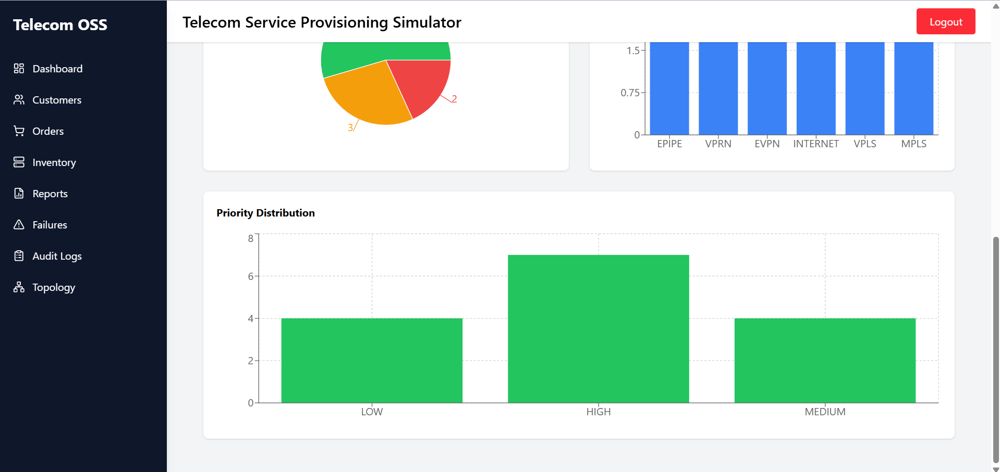

---

### Customers

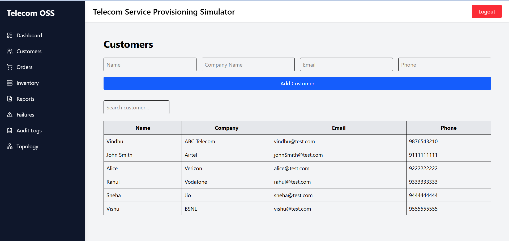

---

### Orders

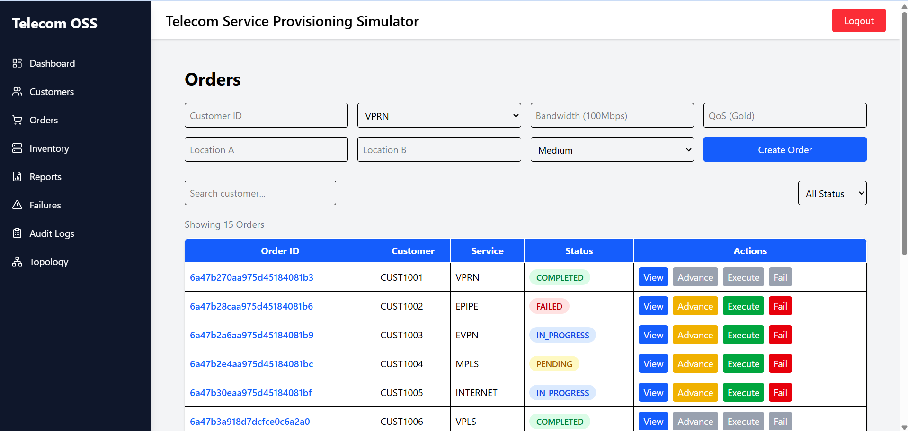

---

### Inventory

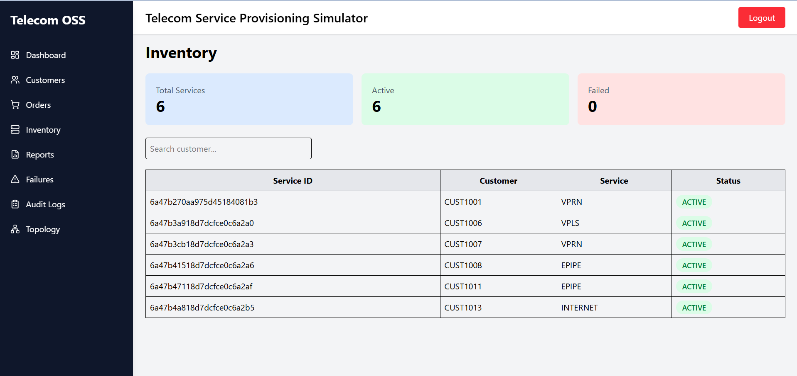

---

### Reports

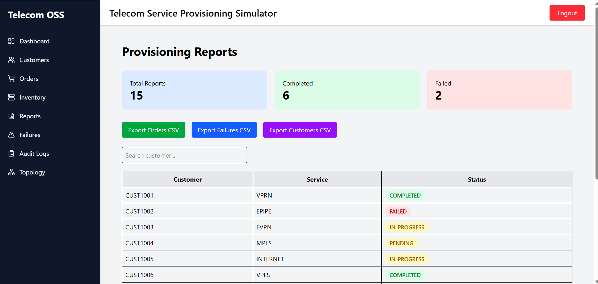

---

### Failures

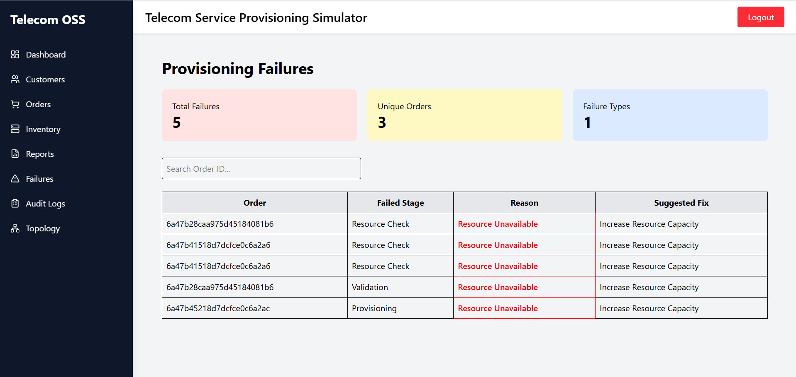

---

### Audit Logs

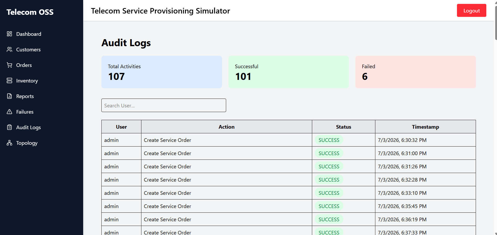

---

## Backend

### Authentication (Swagger OAuth2)

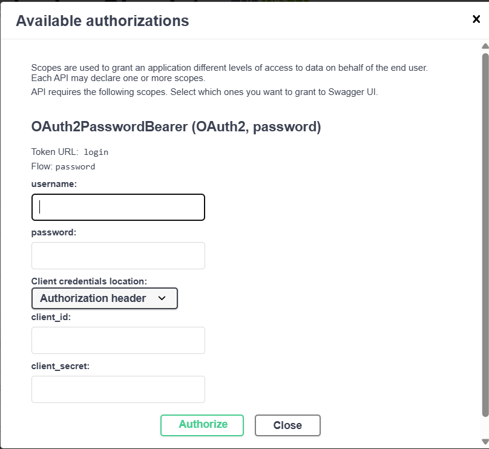

---

### API Documentation (Swagger UI)

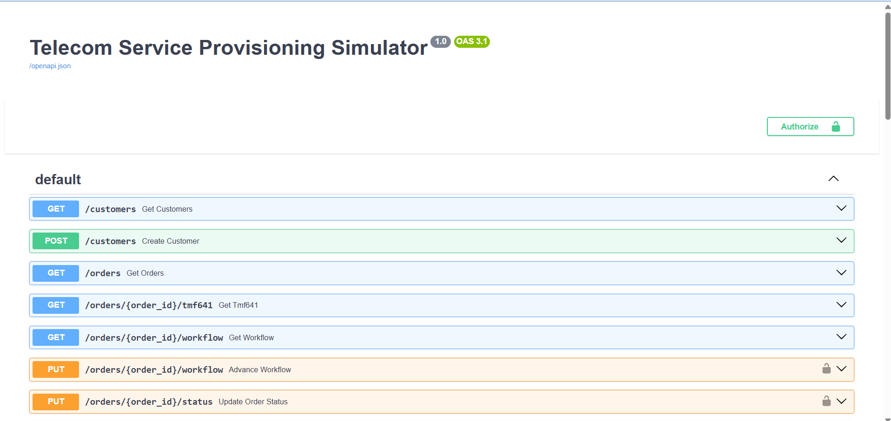

---

### Create Order

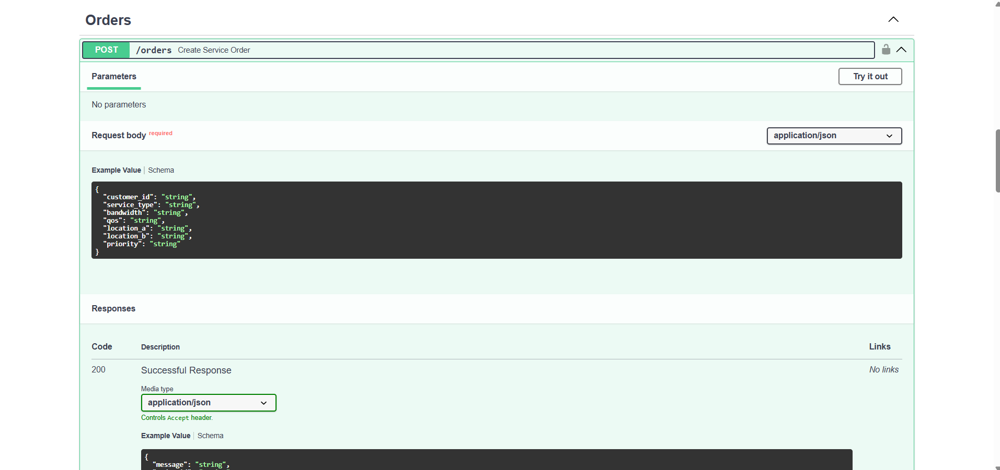

---

### Dashboard Statistics API

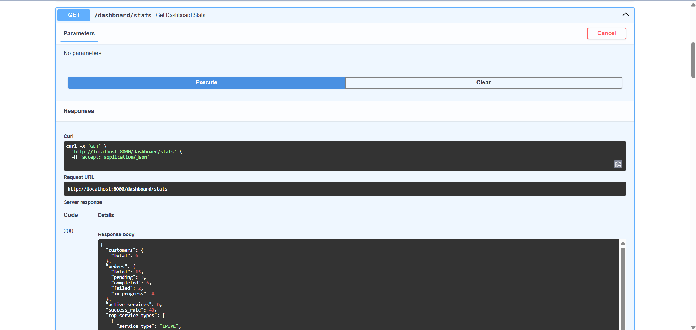

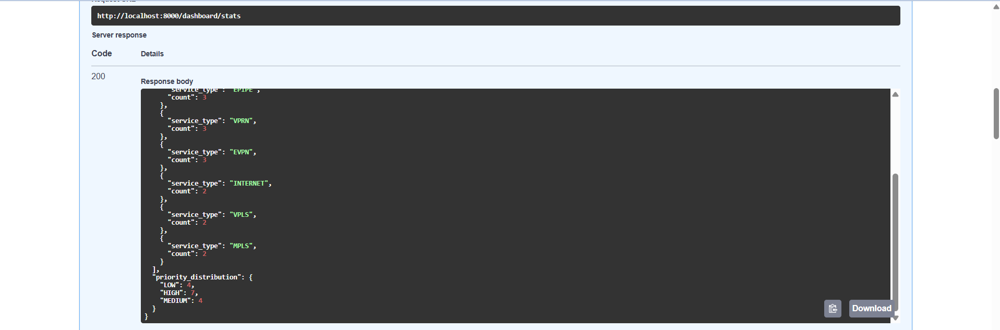

---

### Failure Simulation API

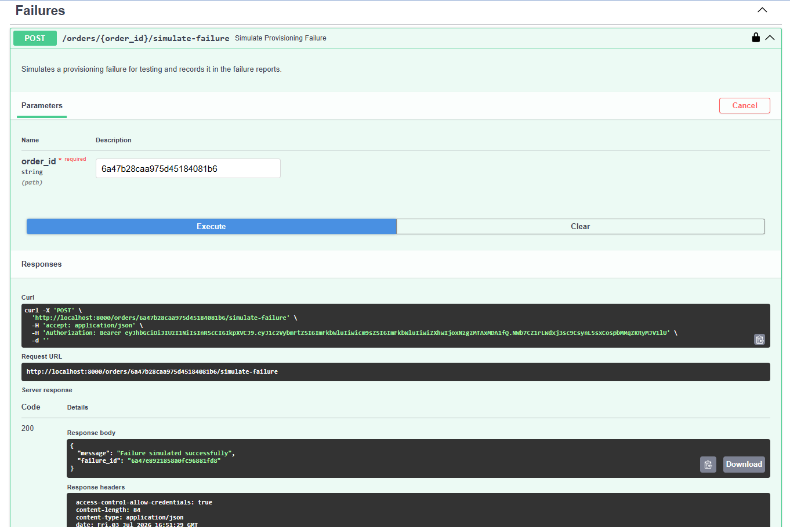

---

### Execute Provisioning API

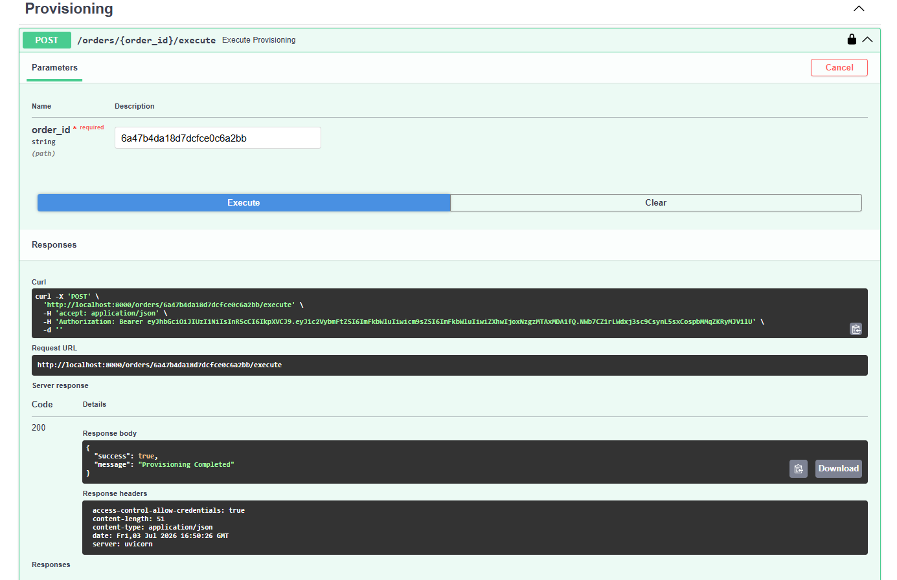

---

### TMF641 Payload

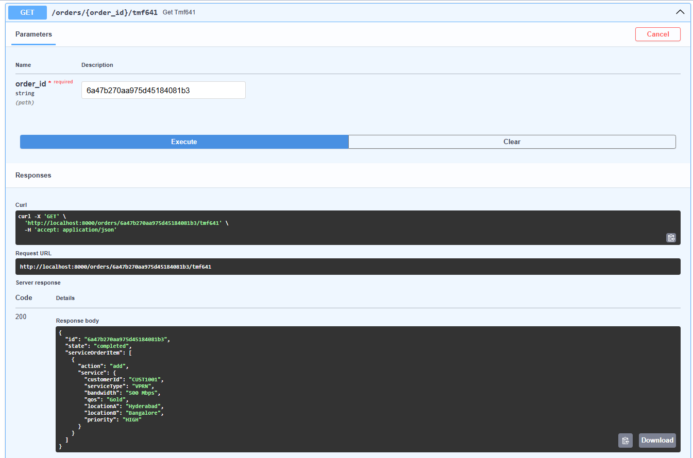

---

### Workflow

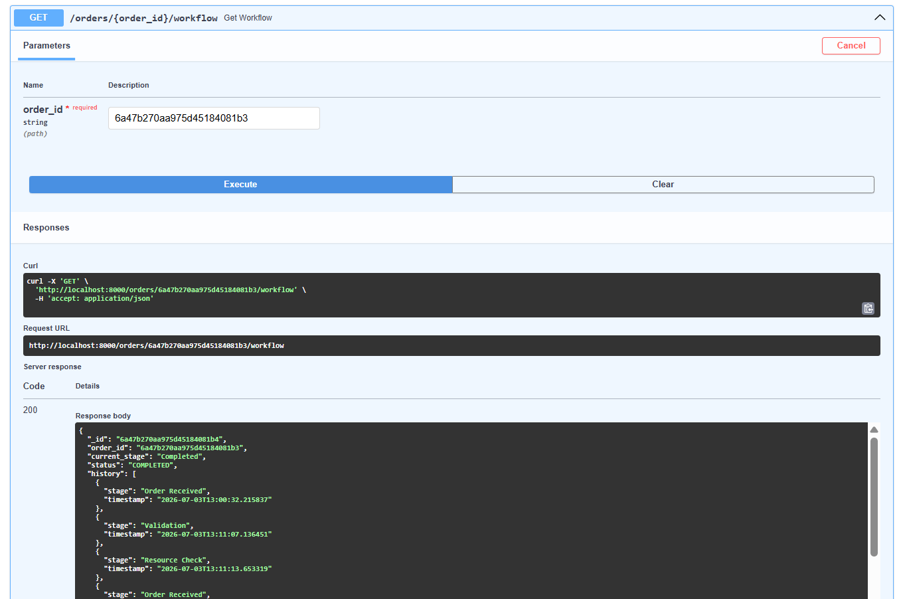

---

## System Architecture

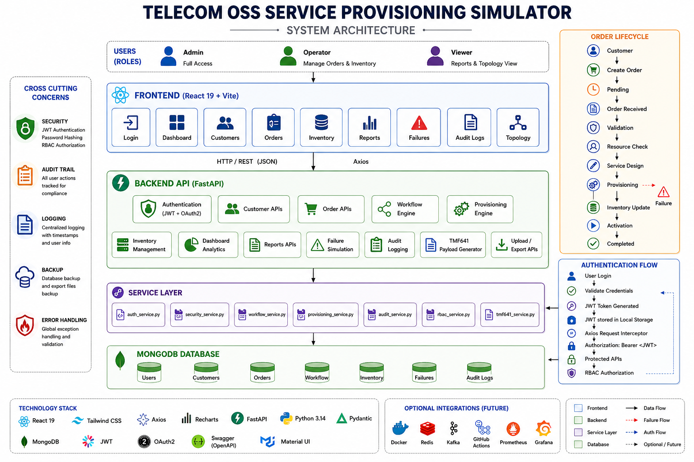

---

# Technology Stack

## Frontend

| Technology | Purpose |
|------------|---------|
| React 19 | Frontend |
| React Router | Routing |
| Tailwind CSS | Styling |
| Axios | API Calls |
| Recharts | Dashboard Charts |
| React Hot Toast | Notifications |
| React Icons | Icons |
| Lucide React | Icons |
| Material UI Icons | UI |

---

## Backend

| Technology | Purpose |
|------------|---------|
| FastAPI | REST APIs |
| Python | Backend |
| MongoDB | Database |
| Pydantic | Validation |
| JWT | Authentication |
| OAuth2 | Authorization |
| Python Logging | Logging |

---

# Project Structure

```text
telecom-service-provisioning-simulator

│

├── backend
│
│   ├── models
│   ├── routes
│   ├── services
│   ├── exports
│   ├── uploads
│   ├── database.py
│   ├── logger.py
│   ├── server.py
│   ├── seed.py
│   ├── requirements.txt
│   └── .env.example
│
├── frontend
│
│   ├── src
│   │
│   ├── api
│   ├── components
│   ├── context
│   ├── layouts
│   ├── pages
│   ├── App.jsx
|   ├── main.jsx 
│   └── .env.example
|   
│
├── screenshots
│
├── docs
│
└── README.md
```
# Installation

## Clone Repository

```bash
git clone https://github.com/vindhu-20/telecom-service-provisioning-simulator.git

cd telecom-service-provisioning-simulator
```

---

# Backend Setup

Navigate to backend

```bash
cd backend
```

Create Virtual Environment

Windows

```bash
python -m venv venv
```

Activate

```bash
venv\Scripts\activate
```

Install Dependencies

```bash
pip install -r requirements.txt
```

Run Backend

```bash
uvicorn server:app --reload
```

Backend URL

```
http://localhost:8000
```

Swagger Documentation

```
http://localhost:8000/docs
```

ReDoc

```
http://localhost:8000/redoc
```

---

# Frontend Setup

Navigate to frontend

```bash
cd frontend
```

Install Packages

```bash
npm install
```

Run Frontend

```bash
npm run dev
```

Frontend

```
http://localhost:5173
```

---

# Environment Variables

## Backend

Copy

```text
backend/.env.example
```

to

```text
backend/.env
```

Example

```env
MONGO_URI=mongodb://localhost:27017

DATABASE_NAME=telecom_provisioning

SECRET_KEY=your-secret-key

ALGORITHM=HS256

ACCESS_TOKEN_EXPIRE_MINUTES=60

CORS_ORIGINS=http://localhost:5173
```

---

## Frontend

Copy

```text
frontend/.env.example
```

to

```text
frontend/.env
```

Example

```env
VITE_API_URL=http://localhost:8000
```

---

# Authentication

The application uses

- JWT Authentication
- OAuth2 Password Flow
- Role Based Access Control (RBAC)

Supported Roles

| Role | Permissions |
|------|-------------|
| Admin | Full Access |
| Operator | Customer, Orders, Provisioning |
| Viewer | Read Only |

Default Users

| Username | Password | Role |
|-----------|----------|------|
| admin | admin123 | Admin |
| operator | operator123 | Operator |
| viewer | viewer123 | Viewer |

---

# API Modules

## Authentication

| Method | Endpoint |
|---------|----------|
| POST | /login |
| GET | /me |

---

## Customers

| Method | Endpoint |
|---------|----------|
| POST | /customers |
| GET | /customers |

---

## Orders

| Method | Endpoint |
|---------|----------|
| POST | /orders |
| GET | /orders |
| PUT | /orders/{id}/workflow |
| POST | /orders/{id}/execute |
| POST | /orders/{id}/simulate-failure |
| GET | /orders/{id}/workflow |
| GET | /orders/{id}/tmf641 |

---

## Inventory

| Method | Endpoint |
|---------|----------|
| GET | /inventory |

---

## Dashboard

| Method | Endpoint |
|---------|----------|
| GET | /dashboard/stats |

---

## Reports

| Method | Endpoint |
|---------|----------|
| GET | /reports |
| GET | /reports/failures |
| GET | /reports/export/orders |
| GET | /reports/export/customers |
| GET | /reports/export/failures |

---

## Audit

| Method | Endpoint |
|---------|----------|
| GET | /audit-logs |

---

## Topology

| Method | Endpoint |
|---------|----------|
| POST | /topology |

---

## Upload

| Method | Endpoint |
|---------|----------|
| POST | /upload |

---

# Provisioning Workflow

```
Customer Creation
       │
       ▼
Create Service Order
       │
       ▼
Workflow Started
       │
       ▼
Validation
       │
       ▼
Resource Check
       │
       ▼
Service Design
       │
       ▼
Provisioning
       │
       ▼
Inventory Update
       │
       ▼
Audit Logging
       │
       ▼
Completed
```

---

# Dashboard

The dashboard provides real-time operational statistics.

Cards

- Total Customers
- Total Orders
- Active Services
- Pending Orders
- Completed Orders
- Failed Orders
- Success Rate

Charts

- Order Status Pie Chart
- Service Distribution Bar Chart
- Priority Distribution Chart

---

# TMF641 Service Order

The simulator generates a TM Forum compliant Service Order.

Example

```json
{
  "id": "ORDER001",
  "state": "completed",
  "serviceOrderItem": [
    {
      "action": "add",
      "service": {
        "customerId": "CUST1001",
        "serviceType": "VPRN",
        "bandwidth": "500 Mbps",
        "priority": "HIGH"
      }
    }
  ]
}
```

---

# Network Topology

Generate a simplified network topology showing

- Customer Sites
- Service Links
- Bandwidth
- QoS
- Primary & Remote Sites

---

# Reports

Reports available

- Provisioning Report
- Customer Report
- Failure Report

Export Formats

- CSV
- JSON

# Security

Implemented Security Features

- JWT Authentication
- OAuth2 Password Flow
- Protected REST APIs
- Role Based Access Control
- Environment Variables
- Password Validation
- Request Validation using Pydantic

---

# Logging

Application logs

- User Login
- Customer Creation
- Order Creation
- Workflow Execution
- Provisioning Events
- Inventory Updates
- Failure Simulation
- Audit Events

---

# Deployment

## Backend

Recommended Platform

Render

Deployment Steps

1. Push code to GitHub

2. Create Render Web Service

3. Connect GitHub Repository

4. Add Environment Variables

5. Deploy

---

## Database

MongoDB Atlas

- Create Cluster
- Create Database User
- Allow Network Access
- Copy Connection String
- Update MONGO_URI

---

## Frontend

Recommended Platform

Vercel

Deployment Steps

1. Import GitHub Repository

2. Configure Build

```bash
npm run build
```

3. Set Environment Variables

4. Deploy


## Backend (Render)

Environment Variables

```env
MONGO_URI=<MongoDB Atlas URI>

DATABASE_NAME=telecom_provisioning

SECRET_KEY=<your-secret-key>

ALGORITHM=HS256

ACCESS_TOKEN_EXPIRE_MINUTES=60

CORS_ORIGINS=https://telecom-service-provisioning-simula.vercel.app
```

---

## Frontend (Vercel)

Environment Variables

```env
VITE_API_URL=https://telecom-service-provisioning-simulator.onrender.com
```

---

# Future Enhancements

- Docker Support
- Docker Compose
- Kubernetes Deployment
- Redis Cache
- Kafka Integration
- Background Workers
- Celery Task Queue
- Prometheus Monitoring
- Grafana Dashboard
- CI/CD with GitHub Actions
- Email Notifications
- WebSocket Live Updates
- Service Rollback
- Approval Workflow
- Multi-Tenant Support
- OpenTelemetry Integration

---

# Learning Outcomes

This project demonstrates practical experience with

- FastAPI
- React
- MongoDB
- JWT Authentication
- OAuth2
- RBAC
- REST API Design
- Telecom OSS Concepts
- TM Forum TMF641
- Workflow Engine
- Provisioning Engine
- Dashboard Development
- Inventory Management
- Failure Handling
- Audit Logging
- CSV Export
- Network Topology
- Modular Backend Architecture

---

# Resume Highlights

This project showcases

- Full Stack Development
- Telecom Domain Knowledge
- OSS/BSS Workflow Simulation
- RESTful API Development
- Authentication & Authorization
- React Dashboard
- MongoDB Integration
- Data Visualization
- Role Based Access Control
- Production Ready Architecture

---

# Contributing

Contributions are welcome.

1. Fork the repository

2. Create a new feature branch

```bash
git checkout -b feature/new-feature
```

3. Commit changes

```bash
git commit -m "Add new feature"
```

4. Push changes

```bash
git push origin feature/new-feature
```

5. Create a Pull Request

---

# Repository

GitHub

https://github.com/vindhu-20/telecom-service-provisioning-simulator

---

# Author

**Vindhu Biyyala**

GitHub

https://github.com/vindhu-20

LinkedIn

http://linkedin.com/in/vindhu-biyyala-14a9101a7

---

# Acknowledgements

Special thanks to

- FastAPI
- React
- MongoDB
- TM Forum Open APIs
- Tailwind CSS
- Recharts

---

# License

This project is licensed under the MIT License.

---

## ⭐ If you found this project useful, consider giving it a Star on GitHub!